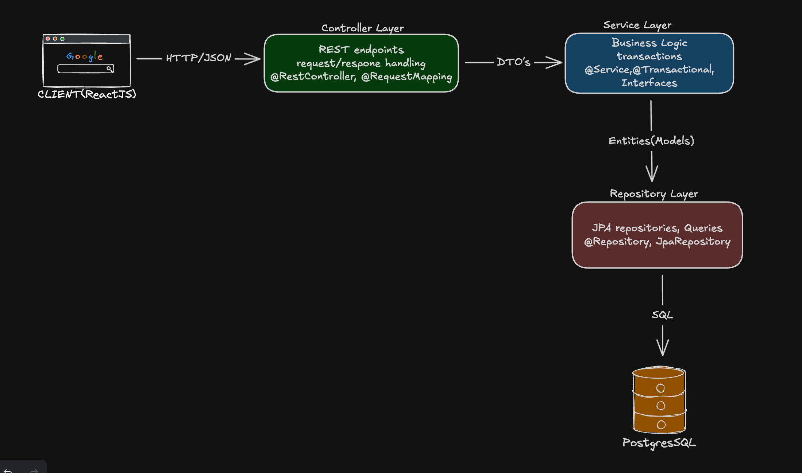
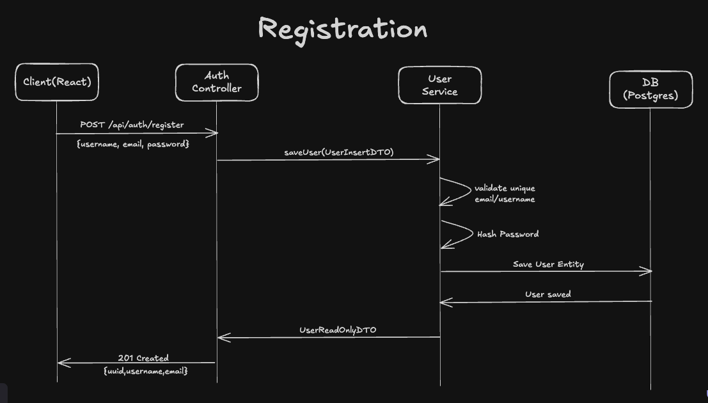
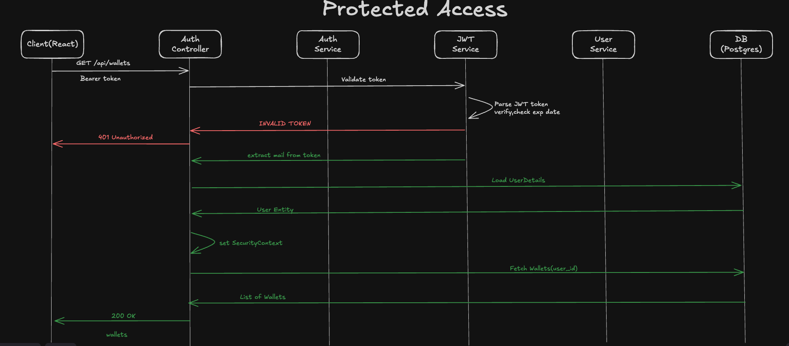

<h1 align="center">

💸 Flux - Expense Tracking API

</h1>


<p align="center">
  
  
  
  
</p>
<p align="center">
  A RESTful API for personal expense tracking, built with Spring Boot following industry best practices.
</p>

---

## 📖 Table of Contents

- [Overview](#-overview)
- [Tech Stack](#-tech-stack)
- [Architecture](#-architecture)
- [Features](#-features)
- [API Endpoints](#-api-endpoints)
- [Getting Started](#-getting-started)
- [Database Schema](#-database-schema)
- [Security](#-security)
- [Best Practices](#-best-practices)
- [API Documentation](#-api-documentation)
- [Author](#-author)

---

## 🎯 Overview

**Flux** is a full-featured expense tracking REST API that allows users to manage their personal finances. Users can create wallets, categorize transactions, and track income/expenses over time.

This project was developed as part of the **Coding Factory @ AUEB** program, demonstrating enterprise-level Spring Boot development practices.

### Key Highlights

- 🔐 Stateless JWT Authentication
- 📊 Multi-wallet support
- 🏷️ Custom transaction categories
- 👤 Complete user data isolation
- 📝 Comprehensive API documentation with Swagger

---

## 🛠️ Tech Stack

| Layer | Technology |
|-------|------------|
| **Framework** | Spring Boot 3.2 |
| **Language** | Java 21 |
| **Database** | PostgreSQL 16 |
| **Security** | Spring Security + JWT |
| **ORM** | Spring Data JPA / Hibernate |
| **Validation** | Bean Validation |
| **Documentation** | OpenAPI 3.0 / Swagger UI |
| **Build Tool** | Gradle |
| **Code Generation** | Lombok |

---

## 🏗️ Architecture

The application follows a **Layered Architecture** pattern, ensuring separation of concerns and maintainability:





### Project Structures
```
src/main/java/gr/aueb/cf/flux/
├── api/                    # REST Controllers
│   ├── AuthController
│   ├── WalletController
│   ├── CategoryController
│   └── TransactionController
├── core/
│   ├── enums/              # TransactionType, Role
│   └── exceptions/         # Custom exceptions
├── dto/                    # Data Transfer Objects
│   ├── *InsertDTO
│   ├── *UpdateDTO
│   └── *ReadOnlyDTO
├── mapper/                 # Entity ↔ DTO mappers
├── model/                  # JPA Entities
├── repository/             # Spring Data repositories
├── security/               # JWT, filters, config
└── service/                # Business logic (interfaces + impl)
```

---

## ✨ Features

### Authentication & Authorization
- ✅ User registration with password validation
- ✅ JWT-based stateless authentication
- ✅ Role-based access control (USER, ADMIN)
- ✅ Secure password hashing (BCrypt)

### Wallet Management
- ✅ Create multiple wallets per user
- ✅ Track balance per wallet
- ✅ Update wallet details
- ✅ Delete wallets

### Category Management
- ✅ Custom user-defined categories
- ✅ Categorize transactions
- ✅ Full CRUD operations

### Transaction Tracking
- ✅ Record income and expenses
- ✅ Associate with wallet and category
- ✅ Date-based tracking
- ✅ Transaction descriptions

---

## 🔗 API Endpoints

### Authentication

| Method | Endpoint | Description | Auth |
|--------|----------|-------------|------|
| `POST` | `/api/auth/register` | Register new user | ❌ |
| `POST` | `/api/auth/authenticate` | Login, get JWT | ❌ |

### Wallets

| Method | Endpoint | Description | Auth |
|--------|----------|-------------|------|
| `GET` | `/api/wallets` | Get all user wallets | ✅ |
| `GET` | `/api/wallets/{uuid}` | Get wallet by UUID | ✅ |
| `POST` | `/api/wallets` | Create new wallet | ✅ |
| `PUT` | `/api/wallets/{uuid}` | Update wallet | ✅ |
| `DELETE` | `/api/wallets/{uuid}` | Delete wallet | ✅ |

### Categories

| Method | Endpoint | Description | Auth |
|--------|----------|-------------|------|
| `GET` | `/api/categories` | Get all user categories | ✅ |
| `POST` | `/api/categories` | Create new category | ✅ |
| `PUT` | `/api/categories/{uuid}` | Update category | ✅ |
| `DELETE` | `/api/categories/{uuid}` | Delete category | ✅ |

### Transactions

| Method | Endpoint | Description | Auth |
|--------|----------|-------------|------|
| `GET` | `/api/transactions` | Get all user transactions | ✅ |
| `GET` | `/api/transactions/{uuid}` | Get transaction by UUID | ✅ |
| `POST` | `/api/transactions` | Create new transaction | ✅ |
| `PUT` | `/api/transactions/{uuid}` | Update transaction | ✅ |
| `DELETE` | `/api/transactions/{uuid}` | Delete transaction | ✅ |

---

## 🚀 Getting Started

### Prerequisites

- Java 21+
- PostgreSQL 16+
- Gradle 8+

### 1. Clone the Repository

```bash
git clone https://github.com/yourusername/flux-backend.git
cd flux-backend
```

### 2. Configure Database

Create a PostgreSQL database:

```sql
CREATE DATABASE fluxdb;
```

### 3. Configure Application Properties

Update `src/main/resources/application.properties`:

```properties
# Database
spring.datasource.url=jdbc:postgresql://localhost:5432/fluxdb
spring.datasource.username=your_username
spring.datasource.password=your_password

# JPA
spring.jpa.hibernate.ddl-auto=update
spring.jpa.show-sql=true

# JWT
app.security.secret-key=your-256-bit-secret-key-at-least-32-characters
app.security.jwt-expiration=86400000
```

### 4. Build and Run

```bash
# Build the project
./gradlew build

# Run the application
./gradlew bootRun
```

The API will be available at `http://localhost:8080`

### 5. Access Swagger UI

Open your browser and navigate to:
```
http://localhost:8080/swagger-ui.html
```

---

## 🗃️ Database Schema


### Entity Relationships

| Relationship | Type | Description |
|--------------|------|-------------|
| User → Wallet | One-to-Many | User owns multiple wallets |
| User → Category | One-to-Many | User creates custom categories |
| Wallet → Transaction | One-to-Many | Wallet contains transactions |
| Category → Transaction | One-to-Many | Category groups transactions |

---

## 🔐 Security

### Authentication Flow



<br>


<br>



### Security Features

| Feature | Implementation |
|---------|---------------|
| Password Hashing | BCrypt  |
| Token Type | JWT (JSON Web Token) |
| Token Expiration | Configurable (default 24h) |
| Session | Stateless |
| CORS | Configured for frontend origin |

### Password Requirements

- Minimum 8 characters
- At least 1 uppercase letter [A-Z]
- At least 1 lowercase letter [a-z]
- At least 1 number [0-9]
- At least 1 special character [!@#$%^&*(),.?":{}|<>]

---

## ⭐ Best Practices

This project demonstrates the following software engineering best practices:

### Architecture & Design

| Practice | Implementation |
|----------|---------------|
| **Layered Architecture** | Controller → Service → Repository |
| **Interface Segregation** | Service interfaces (IWalletService, etc.) |
| **DTO Pattern** | Separate DTOs for Insert/Update/ReadOnly |
| **Mapper Pattern** | Dedicated mapper classes for entity↔DTO |

### Data & Validation

| Practice | Implementation |
|----------|---------------|
| **Bean Validation** | JSR-380 annotations on DTOs |
| **JPA Auditing** | Automatic createdAt/updatedAt |
| **UUID External IDs** | Internal Long id + external UUID |
| **User Data Isolation** | All queries scoped to authenticated user |

### Error Handling & Logging

| Practice | Implementation |
|----------|---------------|
| **Global Exception Handler** | @ControllerAdvice with custom exceptions |
| **Consistent Error Responses** | Standardized error DTOs |
| **Structured Logging** | SLF4J with meaningful log messages |

### Security

| Practice | Implementation |
|----------|---------------|
| **Stateless Authentication** | JWT tokens |
| **Password Security** | BCrypt hashing |
| **CORS Configuration** | Whitelist allowed origins |
| **Custom Security Handlers** | AuthEntryPoint, AccessDeniedHandler |

### Code Quality

| Practice | Implementation |
|----------|---------------|
| **Immutable DTOs** | Java Records |
| **Constructor Injection** | @RequiredArgsConstructor |
| **Transaction Management** | @Transactional with proper settings |
| **RESTful Design** | Proper HTTP methods and status codes |

---

## 📚 API Documentation

Interactive API documentation is available via **Swagger UI**:

```
http://localhost:8080/swagger-ui.html
```

Features:
- Try out endpoints directly
- View request/response schemas
- Authentication support
- Example values

---

## 👨‍💻 Author

**Alexandros**

- 🎓 Coding Factory @ Athens University of Economics and Business (AUEB)
- 📧 [your.email@example.com]
- 💼 [LinkedIn Profile]
- 🐙 [GitHub Profile]

---

## 📄 License

This project was developed for educational purposes as part of the Coding Factory program at AUEB.

---

<p align="center">
  Made with ☕ and Spring Boot
</p>
